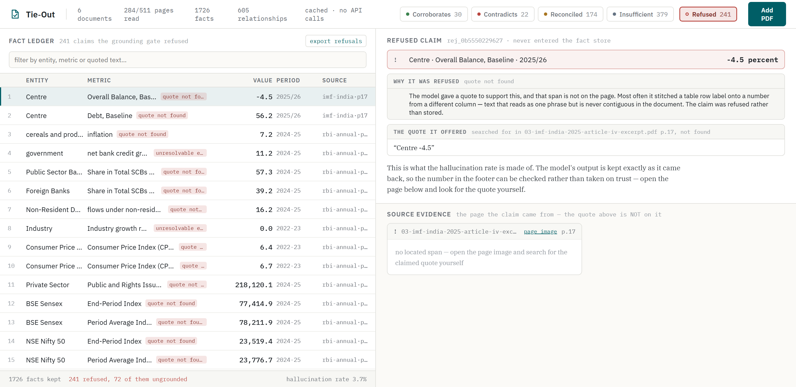

# Tie-Out — a fact knowledge layer with an audit trail

Extracts checkable claims from PDFs, refuses any it cannot quote, and works out
whether two claims corroborate each other, contradict each other, or only look
like they disagree.


The idea the whole system rests on:

> **Comparability is a separate, prior question to agreement.**

Every fact carries a **claim frame** — entity, metric, unit, period, basis. The
comparator walks those five dimensions *before* it looks at a single value. What
the walk finds decides the label, and the walk itself is what you see on screen:

| frame | values | label |
|---|---|---|
| identical | agree within tolerance | `CORROBORATES` |
| identical | differ beyond tolerance | `CONTRADICTS` |
| differs on exactly one dimension | irrelevant | `CONTEXTUALLY_RECONCILED` — and it names the dimension |
| cannot be established | — | `INSUFFICIENT_EVIDENCE` |

No model participates in that classification. It is rules, it is unit-tested,
and it prints its reasoning.

---

## Setup and Run Instructions

```bash
git clone https://github.com/Maaadhavq/tieout && cd tieout
python -m pip install -r requirements.txt
```

There are two corpora, and the UI always says which one is on screen.

**Reproduce the four required cases with no API key:**

```bash
python run.py --gold
```

Builds a store from the eleven facts located by hand in the starter PDFs
(`tests/golden/cases.yaml`), pushed through the real grounding, normalization
and comparison code, and serves the viewer at <http://127.0.0.1:8000>. The UI
labels this corpus as the reference set.

**Replay a full extraction run with no API key:**

```bash
python run.py --demo
```

Replays the committed extraction cache over the starter PDFs — the same
result as a live run, zero API calls. This is the corpus the measured numbers
below come from.

**Live extraction:**

```bash
cp .env.example .env        # then put your Gemini key in it
python run.py               # ingests data/starter-datasets/, then serves
python run.py --paths some/other.pdf
```

**Confirm the four required cases in fifteen seconds, no API key:**

```bash
python -m tieout.verify
```

Prints each case with both facts, the full comparability trace, both verbatim
quotes with document and page, the confidence and the explanation. Exits
non-zero if a case is missing. The cases are found by *query*, not by
hard-coded row ids, so it works on any corpus — including one you ingest
yourself.

**Export the ledger to a spreadsheet:**

```bash
curl -o facts.csv          localhost:8000/api/export.csv
curl -o relationships.csv  localhost:8000/api/export/relationships.csv
curl -o refused.csv        localhost:8000/api/export/refused.csv
```

`refused.csv` is the working behind the hallucination rate: every claim the
gate would not accept, with the model's own words intact. A rate nobody can
audit is just a number.

Every fact row carries its source document, page, verbatim quote and match
quality alongside the value — a figure in a spreadsheet without the sentence it
came from is the thing this system exists to avoid. The ledger's export link
follows whatever filter is active.

**Tests and evaluation:**

```bash
python -m pytest -q                  # 133 tests, no API key needed
python -m tieout.eval --db data/demo.db
```

Python 3.10+. Only real dependencies are PyMuPDF, FastAPI and the Gemini SDK.

---

## Video Demo

*(link to be added)*

---

## Approach

### The pipeline

```
PDF
 └─ PyMuPDF: page text + word-level bounding boxes          deterministic
     └─ junk filter: pages that cannot assert anything      deterministic
         └─ Gemini Flash: structured extraction             model
             └─ GROUNDING GATE: is the quote really there?  deterministic
                 └─ normalize unit · magnitude · period · basis
                     └─ SQLite fact + evidence store
                         └─ blocking on (entity, metric)    deterministic
                             └─ 4-way frame comparator      deterministic
                                 └─ adjudication, only for unsettled aliases
                                     └─ FastAPI · evidence viewer
```

The model does one thing well — turning a sentence of financial English into
fields. Everything around it is deterministic, so a bad extraction surfaces as a
*rejected fact* rather than a wrong answer.

### The grounding gate

Every fact must carry a verbatim span. Before it is stored, the span is searched
for in the page text — exact, then whitespace/ligature-normalized, then fuzzy.
If it is not there, the fact is **rejected and counted**, with the model's raw
output kept in the `rejects` table.

This is what turns "cite your source" into "have one". It is also where the
hallucination rate in `/api/stats` comes from, and it is deliberately the one
step no model participates in.

It bites, too. The first version of the gold set quoted `"8,142 Cr"` for a
Delhivery figure; the gate refused it as too short to be evidence, which was
correct — the quote was widened to `"₹8,142 Cr FY24 revenue from services"`,
which carries the value, the period *and* the metric.

### Normalization is where the work is

Three publishers write the same year three ways, and one company writes a
different year the same way:

```
Economic Survey  "FY25"        ─┐
RBI              "2024-25"      ├─ 2024-04-01 … 2025-03-31
IMF              "FY2024/25"   ─┘
Delhivery        "FY24"        ─── 2023-04-01 … 2024-03-31
```

Tolerance comes from the precision each source claimed, not a fixed epsilon, so
`₹81,415.38 million` and `₹8,142 crore` agree while `6.4%` and `6.5%` do not —
even though the second pair is closer in absolute terms.

And `basis` carries the dimensions that turn an apparent contradiction into an
explained one: consolidation, **data vintage** (advance / provisional / revised
estimate / projection / realized), price basis, valuation, measure, geography.
Vintage is the highest-value field in the schema: institutional publishers
restate the same period repeatedly as data firms up, and a system that does not
model it reports every restatement as a contradiction.

### Where a model is and is not used

| step | engine |
|---|---|
| reading prose and tables into fields | Gemini Flash |
| verifying the quote exists | deterministic — the checker must not be the thing being checked |
| unit, magnitude, period, basis normalization | deterministic, unit-tested |
| candidate pair generation | deterministic blocking |
| relationship classification | deterministic, rule-traced |
| "do these two metric labels mean the same thing?" | Gemini Flash, capped at 40 calls, cached with its rationale |
| explanations | templated from the rule trace, so prose and verdict cannot drift |

### AI tools used

Built with Claude Code (Opus 5) — architecture, implementation and tests.
Extraction and alias adjudication at runtime use Google Gemini Flash. The four
demonstrated cases were located by reading the source PDFs by hand before any
extractor existed; they are not model output.

---

## The four required cases

Every one of these is in the extracted corpus — `python run.py --demo`, no API
key — and reproducible on the hand-labelled reference set with
`python run.py --gold`. Page numbers are 1-based indices into the excerpts.

### 1. Corroborated across documents, expressed differently

**RBI Annual Report 2024-25, p.22** — "6.5 per cent in **2024-25**"
**IMF Article IV 2025, p.10** — "India's real GDP grew by 6.5 percent in
**FY2024/25**"

Two institutions, two notations for one interval. → **CORROBORATES** (0.93).

A harder one, in the same corpus: the annual report's `₹81,415.38 million`
against the earnings deck's `₹8,142 crore` — and `₹1,266 Mn` against `₹127 Cr`
for EBITDA. Same figures, different scales, rounded differently. No string
matcher finds these; they match only after magnitude normalization at the
precision the *rounder* source claimed.

### 2. A genuine contradiction

**Economic Survey 2024-25, p.20** — "India's GDP at constant (2011-12) prices
grew by **6.7 per cent** and 5.4 per cent in **Q1** and Q2 **FY25**"
**RBI Annual Report 2024-25, p.24** — "real GDP rose (y-o-y) by **6.5 per
cent** in **Q1:2024-25**"

Same entity, metric, unit, price basis and measure. The two period notations
normalise to the same quarter. The values differ by 0.2 percentage points and
neither document explains why → **CONTRADICTS** (0.93).

This one only surfaces if quarters parse correctly. An earlier version read
`"Q1:2024-25"` as the whole of 2024-25 and reported a *different*, false
contradiction instead; see `docs/DECISIONS.md` D14.

### 3. An apparent contradiction explained by context

Found on four different dimensions:

- **Data vintage.** Economic Survey p.14 says **6.4%** for FY25; RBI p.8 says
  **6.5%** for 2024-25. Same country, metric and period — but the Survey quotes
  the first advance estimate. Different vintages of one measurement, not rival
  claims. → **reconciled (data vintage)**, 0.90.
- **Consolidation.** Delhivery's FY24 revenue is `₹74,540.82 million`
  standalone and `₹81,415.38 million` consolidated.
- **Measure.** GDP growth against GVA growth — different aggregates, not
  expected to match.
- **Sign convention.** A loss written `2,491.86` in the narrative and
  `(2,491.86)` in the statements is one figure, not two claims.

And a non-numeric one, from the reference set: Suvir Suren Sujan is a
Non-Executive Nominee Director in the 2022 prospectus (p.88) and *resigned with
effect from August 24, 2023* in the FY24 annual report (p.33) — a state change
over time, reconciled by the same machinery.

### 4. Extraction failures, measured

Four classes, all visible in the tooling rather than described:

- **Ungrounded claims — 72 of 1,967 (3.7%).** The model produced a quote that
  is not in the page. Click **Refused** in the header to see every one of them
  in the ledger: what was claimed, the quote offered, and the page it came from,
  so you can look for that span yourself and find it is not there. A specimen —
  `"Revenue from contract with customers ... 8,035.88"` — is a table row label
  welded to a number from another column: it reads as one phrase and is never
  contiguous in the document.

  
- **First-person entities — 163.** Filings say "our Company" and "the Group".
  These are well-grounded facts that name nothing on their own; blocking on
  them would compare every filing's "company" facts against every other's, so
  they are refused. Resolving them to the document's subject is the first thing
  I would build next.
- **Tables lose their row headers — 17 of the 22 contradictions.** They are
  same-page pairs from the Delhivery filings like "Borrowings 1,316.09 vs
  1,697.34, same date, same page" — current versus non-current, with the
  qualifier lost because reading order flattens a table into a stream. Because
  both sides come off one page, the comparator hedges them to 41–42% confidence
  *saying that*, rather than asserting them. The fix is geometry-aware table
  reconstruction from the word boxes already extracted for the highlights.
- **A value bound to the wrong metric — 4, and the gate cannot see them.** All
  four are IMF Article IV prose where one sentence carries two percentages.
  P.3 reads *"Under the baseline assumption of prolonged 50 percent U.S.
  tariffs, real GDP is projected to grow at 6.6 percent in FY2025/26"*; the
  model took the **50** as the growth rate. That quote is on the page character
  for character, so the gate passed it — it checks that the quote is really
  there, not which number inside it the metric refers to. Three of the four land
  on one page and are hedged to 41–42% like the tables. The fourth compares p.3
  against p.13, gets none of that hedging, and is asserted as a **93%-confidence
  contradiction that is simply wrong** — the only confidently wrong relationship
  in the corpus. The correct reading of that same sentence was also extracted,
  and corroborates p.13 at 93%. This is the honest limit of what a
  quote-presence gate can catch.

That accounts for 21. The 22nd is the real one: the cross-document disagreement
in case 2 above.

A page with no text layer (IMF Article IV p.1, a scanned cover) yields nothing
at all and is counted among the 24 pages the junk filter skipped.

The negative control matters as much: Economic Survey p.4 says 6.4% and RBI
p.26 says 6.4%, same country, same period. A value-first system corroborates
them. They are GDP and GVA, and the comparator suppresses the pair
(`tests/test_compare.py`).

---

## Limitations and Next Steps

### Measured, on the corpus in `data/demo.db`

| | |
|---|---|
| documents / pages | 6 · 511 pages, 24 skipped by the junk filter |
| pages a model answered for | **284 of 487 candidates** — the run was cut short, see below |
| facts the model emitted | 1,967 |
| facts kept | 1,726 |
| facts refused by the gate | 241 (12.2%) — 165 unresolvable entity, 72 ungrounded, 4 unparseable |
| **hallucination rate** | **3.7%** — ungrounded claims / claims emitted |
| quote match quality | 1,712 exact, 12 fuzzy, 2 normalized (99.2% exact) |
| distinct metrics discovered | 961, none of them hard-coded |
| pairs compared | 2,325, against 1,488,675 if compared naively (0.16%) |
| relationships | 30 corroborates · 22 contradicts · 174 reconciled · 379 insufficient |
| suppressed | 387 same-document time series, 1,237 unresolved alias questions |
| relationship accuracy | 7/7 labelled pairs, 2/2 negative controls |

### What it costs to run

| | |
|---|---|
| `python run.py --demo` from cold | 0.7 s |
| `python -m tieout.verify` | 0.1 s |
| `GET /api/stats` | 4 ms |
| `GET /api/facts` (1,726 facts, 1.9 MB) | 151 ms |
| `GET /api/relationships` (605, 1.0 MB) | 63 ms |
| `GET /api/export.csv` (532 KB) | 313 ms |
| ingest, live, per page | ~2 s, 6 pages in parallel |
| re-ingesting a document already seen | free — content-hash dedup, no model call |

Comparison is the part that could have been expensive and is not: 2,325 pairs
were considered against 1,488,675 if every fact were compared with every other,
because blocking only ever pairs facts sharing an entity and a metric. The model
is never asked to compare anything.

**The run is incomplete and the numbers say so.** The free-tier daily quota ran
out partway through, so 284 of 487 candidate pages were actually read. The
cache means resuming costs nothing, and every figure above is over the pages
that were read, not all of them. `pages_extracted` and `pages_candidate` are
reported separately in `/api/stats` for exactly this reason.

### What does not work yet

- **First-person entities are dropped, not resolved.** 163 well-grounded facts
  lost because the document said "our Company". This is the largest single
  source of lost recall and the first thing to fix.
- **Tables lose their row headers**, which is where 17 of the 22 contradictions
  come from. Geometry-aware reconstruction using the word boxes already
  extracted for the highlights is the fix.
- **The grounding gate checks the quote, not the binding.** A sentence carrying
  two numbers can have the wrong one attached to the metric and still verify
  exactly. Four contradictions come from this, and one of them is asserted at
  93% confidence and is wrong (IMF p.3, above). Requiring the value to appear in
  a fixed window around the metric mention inside the quote would catch this
  class, and is the change I would make next after first-person entities.
- **No OCR.** A scanned page yields nothing.
- **Relative periods are dropped.** 108 facts carried a period phrase that never
  resolved to an absolute interval — "a year ago" (13), "previous year" (11),
  "one year preceding the date of this prospectus" (9), bare months and
  quarters, and a few that were not periods at all. With no anchor they get no
  period, and any comparison involving them returns `INSUFFICIENT_EVIDENCE`.
  That is honest, and it is most of that bucket: 338 of the 379 insufficient
  pairs fail on `period`, and 352 of them have no period on at least one side.
- **Entity resolution is deliberately shallow** — exact match, or one name
  contained in the other. It will not merge "Reserve Bank of India" with "RBI"
  unless a document writes them together. A wrong merge corrupts every
  comparison downstream, so this errs conservative.
- **No unit conversion of any kind.** Rupees against dollars, TWh against GWh,
  tonnes against kilograms — all reported incomparable rather than converted,
  because no conversion factor is ever in evidence. Spelling variants of one
  unit (`mm` / `millimetres`) are folded; different units never are.
- **Confidence is composed, not calibrated.** A defensible product of grounding
  quality, frame completeness and period certainty — but not fitted against
  outcomes, because there are not enough labelled pairs to do that honestly.
- **A PDF can address the model, and there is no way around that.** Reading the
  document is the job, so an uploaded file that says "ignore your instructions"
  reaches the extractor. What is guaranteed is narrower and more useful: nothing
  enters the store without a quote that is really on the page, so an injection
  can only ever surface as *"the document said this"*, with the sentence and page
  shown next to it — never as an invented figure. Fabrications the page does not
  support are refused whether or not a model was talked into them
  (`tests/test_injection.py`). Metric labels, which also originate in PDFs and
  reach the adjudicator's prompt, are clamped to 120 printable characters on one
  line. This bounds the blast radius; it does not eliminate the class.
- **Ingest is synchronous.** A large upload holds the request open — 18 pages
  took 57 seconds. Uploads are capped at 50 MB (`TIEOUT_MAX_UPLOAD_MB`). A job
  queue would fix the UX and add moving parts an evaluator would have to
  understand, so at this scale it is a deliberate omission rather than an
  oversight.
- **The adjudicator was never exercised on the full corpus.** 1,237 alias
  questions went unanswered because the quota was gone; those pairs are
  suppressed rather than guessed. With budget, `revenue from operations` and
  `revenue from services` resolve and the pair corroborates — that path is
  tested (`tests/test_compare.py`).

### Next, in order

1. Resolve first-person entities against the document's subject.
2. Geometry-aware table reconstruction from the stored word boxes.
3. Calibrate confidence against a larger labelled set.
4. Let a reviewer correct a verdict in the UI, so corrections become new
   labelled pairs.

---

## Additional Notes

**Incremental ingest works and is not a special case.** Because blocks are keyed
on stored columns, adding a document extracts its facts and compares them only
against the members of the blocks they join — existing relationships are never
recomputed (`reason/blocking.py:pairs_for_new_facts`). Uploading a PDF through
the UI exercises this path. Re-uploading a document already in the layer is
detected by content hash and costs nothing.

**The decision log is `docs/DECISIONS.md`** — ten decisions with what else was
considered and what each one costs. The most useful entry is probably D4: a page
ranker was built, measured against the labelled set, found to rank the pages
carrying the headline claims in the bottom decile, and deleted.

**Reading the code.** The interesting file is `tieout/reason/compare.py` — about
150 lines, no dependencies beyond the normalizers, and it is the entire
classification logic. `tieout/normalize/` is where the real difficulty lives.

Each view is deep-linkable, so a case can be sent as a link:
`#corroborates`, `#contradicts`, `#reconciled`, `#insufficient`, `#refused`.

**Everything is inspectable without the UI:**

```bash
python -m tieout.verify              # the four cases, with evidence
curl localhost:8000/api/stats
curl 'localhost:8000/api/relationships?label=CONTEXTUALLY_RECONCILED'
curl localhost:8000/api/facts/M1
sqlite3 data/gold.db 'select label, dimension, confidence from relationships'
```

No credentials are in this repository. `.env` is gitignored; `.env.example`
shows what is needed.
