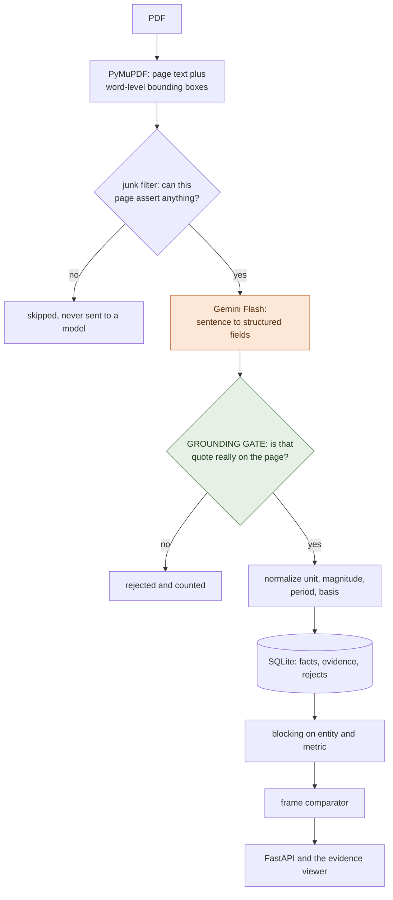
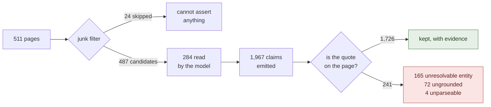
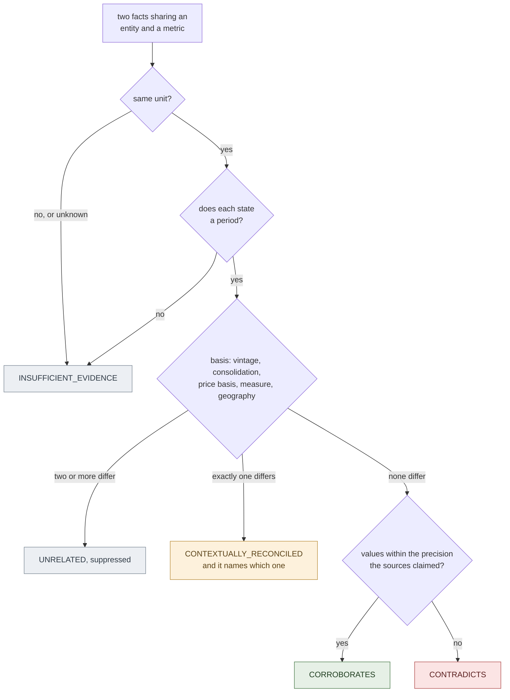

# Tie-Out, a fact knowledge layer with an audit trail

Tie-Out reads PDFs, pulls out claims it can quote, and works out whether two
claims agree, disagree, or only look like they disagree. Every fact carries the
sentence it came from, and you can click through to that sentence highlighted on
the page.

**[3-minute demo video](https://drive.google.com/file/d/1eskQUdjXgBxpPLj_ICCHYK3TMX_NsZYR/view?usp=sharing)**  ·  **[live viewer, no install](https://maaadhavq.github.io/tieout/)**  ·  **[the four required cases](#the-four-required-cases-no-key-under-a-second)**

---

## Setup and Run Instructions

```bash
git clone https://github.com/Maaadhavq/tieout && cd tieout
python -m pip install -r requirements.txt
```

Python 3.10+. The real dependencies are PyMuPDF, FastAPI and the Gemini SDK.

### The four required cases, no key, under a second

```bash
python -m tieout.verify
```

Prints each case with both facts, the full comparability trace, both verbatim
quotes with document and page, the confidence and the explanation. Exits
non-zero if a case is missing.

If you read nothing else here, read that output.

### Think it's rigged? Two commands

```bash
python -m tieout.verify --db data/gold.db     # same verifier, different corpus
python run.py --demo --rebuild --no-serve     # recompute all 605 verdicts, no API calls
```

The first runs identical code over a separate 11-fact corpus. Cases are picked by
query, never by id, so they turn up there too.

The second throws away all 605 verdicts and recomputes them from the facts in 14
seconds, no model calls. Stripping the store back to the cached page responses and
rebuilding everything gives the same 1,726 facts and 241 refusals too.

### See it

```bash
python run.py --demo
```

Replays the committed cache and serves the viewer at <http://127.0.0.1:8000>.
Zero API calls. Every number below comes from this corpus.

`python run.py --gold` serves the smaller hand-labelled corpus instead. The UI
says which one is on screen.

### Your own PDFs, the only step that needs a key

```bash
cp .env.example .env        # then put your Gemini key in it
python run.py               # ingests data/starter-datasets/, then serves
```

Then **Add PDF** in the viewer, or `python run.py --paths your.pdf`. No PDF to
hand? `data/unseen/` holds one the system has never read.

A free key from [aistudio.google.com](https://aistudio.google.com/apikey) takes a
minute, and this whole corpus came off the free tier. Only new documents need one.
Upload without a key and the app says so instead of reporting zero facts.

### Tests, evaluation, exports

```bash
python -m pytest -q                        # 148 tests, no API key
python -m tieout.eval --db data/demo.db    # accuracy and extraction numbers
curl -o facts.csv localhost:8000/api/export.csv
```

Every CSV row carries its document, page, quote and match quality beside the
value. `refused.csv` is the working behind the hallucination rate.

### Or without installing anything

[maaadhavq.github.io/tieout](https://maaadhavq.github.io/tieout/) is the same
viewer as a static snapshot, deep-linked per case:
[corroborates](https://maaadhavq.github.io/tieout/#corroborates),
[contradicts](https://maaadhavq.github.io/tieout/#contradicts),
[reconciled](https://maaadhavq.github.io/tieout/#reconciled),
[refused](https://maaadhavq.github.io/tieout/#refused). Read-only, since Pages
runs no Python.

---

## Video Demo

**[Watch the 3-minute demo](https://drive.google.com/file/d/1eskQUdjXgBxpPLj_ICCHYK3TMX_NsZYR/view?usp=sharing)**

A PDF processed live, then all four required cases with their evidence.

---

## Approach


One idea holds the whole thing up:

> **Whether two numbers are comparable is a separate question, asked first, from
> whether they agree.**

So every fact carries a **claim frame** of entity, metric, unit, period and
basis, and the comparator walks those five before it looks at a value:

| the frame | the values | the verdict |
|---|---|---|
| identical | agree within tolerance | `CORROBORATES` |
| identical | differ beyond tolerance | `CONTRADICTS` |
| differs on exactly one dimension | irrelevant | `CONTEXTUALLY_RECONCILED`, naming the dimension |
| cannot be established | n/a | `INSUFFICIENT_EVIDENCE` |

No model takes part in that decision. It is rules, it is unit-tested, and it
shows its working on screen.

### The pipeline

One model call per page, and nothing else. Every other step is deterministic, so
a bad extraction shows up as a *rejected fact* rather than a wrong answer.



Orange is the only place a model reads a document. Green checks its work, and no
model takes part in that.

### The grounding gate

Every fact has to carry a verbatim span. Before it is stored, that span is hunted
for on the page: exact, then whitespace and ligature normalized, then fuzzy.

Not there means **rejected and counted**, with the model's raw output kept in a
`rejects` table you can browse in the UI.

That is what turns "cite your source" into "have one".



Those 72 ungrounded claims are 3.7% of everything the model emitted. That is the
published hallucination rate, and `refused.csv` is the working behind it.

It bites me too. My first gold entry quoted `"8,142 Cr"`; the gate refused it as
too short to be evidence, and it was right.

### How a pair becomes a verdict

The part worth reading the code for. `tieout/reason/compare.py`, about 150 lines,
holds all of it.



One simplification: a non-overlapping period difference inside a single document
is a time series, not a reconciliation. 384 of those are suppressed.

### Normalization is where the work is

Three publishers write the same year three different ways, and one company writes
a different year the same way:

```
Economic Survey  "FY25"        ─┐
RBI              "2024-25"      ├─ 2024-04-01 … 2025-03-31
IMF              "FY2024/25"   ─┘
Delhivery        "FY24"        ─── 2023-04-01 … 2024-03-31
```

Tolerance comes from the precision each source claimed, not a fixed epsilon. So
`₹81,415.38 million` and `₹8,142 crore` agree, while `6.4%` and `6.5%` do not.

`basis` carries what turns an apparent contradiction into an explained one:
consolidation, vintage, price basis, valuation, measure, geography. Vintage
matters most, because institutions restate a period as data firms up, and a
system that ignores that calls every restatement a contradiction.

### Comparison is cheap, because of blocking

Facts group into blocks keyed on entity and metric, and only facts inside a block
are compared. 1,726 facts into 1,274 blocks and **2,628 pairs**, against 1,488,675
naive: **0.18% of the work**, one pass, no API calls.

### Where a model is and is not used

| step | engine |
|---|---|
| reading prose and tables into fields | Gemini Flash |
| verifying the quote exists | deterministic, since the checker must not be the thing being checked |
| unit, magnitude, period, basis normalization | deterministic, unit-tested |
| candidate pair generation | deterministic blocking |
| relationship classification | deterministic, rule-traced |
| "do these two metric labels mean the same thing?" | Gemini Flash, capped at 40 calls, cached with its rationale |
| explanations | templated from the rule trace, so prose and verdict cannot drift |

### AI tools used

Built with Claude Code (Opus 5) for architecture, implementation and tests.
Extraction and alias adjudication call Google Gemini Flash at runtime.

I picked the four cases by reading the source PDFs myself, before the extractor
existed, so they are not cherry-picked from model output. What you see is still
the system's own work: `verify` finds them by query, and every fact records which
model produced it.

---

## The four required cases

All four are in the extracted corpus and reproduce with `python -m tieout.verify`.
Page numbers are 1-based into the excerpts.

**1. Corroborated across documents, expressed differently.**

RBI Annual Report p.22 says "6.5 per cent in **2024-25**". IMF Article IV p.10
says "India's real GDP grew by 6.5 percent in **FY2024/25**". Two institutions,
two notations, one interval. **CORROBORATES at 0.93.**

Harder pair, same corpus: `₹81,415.38 million` against `₹8,142 crore`. No string
matcher finds that. It matches only after magnitude normalization, at the
precision the rounder source claimed.

**2. A genuine contradiction.**

Economic Survey p.20 says GDP "grew by **6.7 per cent** … in **Q1** … **FY25**".
RBI p.24 says "**6.5 per cent** in **Q1:2024-25**".

Same entity, metric, unit, price basis and measure, and both notations normalize
to the same quarter. The values differ by 0.2 points and neither document explains
why. **CONTRADICTS at 0.93.**

It only surfaces if quarters parse right. An earlier version read `"Q1:2024-25"`
as the whole year and reported a false contradiction instead.

**3. An apparent contradiction explained by context.**

Economic Survey p.14 says **6.4%** for FY25. RBI p.8 says **6.5%** for 2024-25.
Everything matches except one thing: the Survey is quoting the first advance
estimate. **Reconciled on data vintage at 0.90.**

The same machinery reconciles consolidation (standalone against consolidated
revenue), measure (GDP against GVA) and sign convention, and one non-numeric case:
a director active in the 2022 prospectus, *resigned with effect from August 24,
2023* in the FY24 report.

**4. An extraction failure, and what I did about it.**

Click **Refused** in the viewer for all 241 rejected claims in the model's own
words. Four classes:

| what went wrong | how many | what I did |
|---|---|---|
| the quote is not on the page | 72, or 3.7% of everything emitted | nothing to fix: this is the gate working. Usually a table row label welded to a number from another column |
| first-person entities, "our Company" | 163 | refused rather than guessed at. Would fix by resolving them against the document's subject |
| lost table row headers | 14 of the 19 contradictions | hedged to 41 or 42% confidence saying exactly that. Would fix with geometry-aware reconstruction from the word boxes I already store |
| confidently wrong | 1 | see below |

That last one is worth the space. IMF p.3 reads *"prolonged 50 percent U.S.
tariffs, real GDP is projected to grow at 6.6 percent"*, and the model took **50**
as the growth rate.

The quote is on the page character for character, so the gate passed it: it checks
that the quote is there, not which number the metric refers to. Against p.13 that
becomes a 93%-confidence contradiction that is simply wrong.

The negative control matters as much. Economic Survey p.4 and RBI p.26 both say
6.4% for the same country and period, so a value-first system corroborates them.
They are GDP and GVA. The comparator suppresses the pair.

---

## Limitations and Next Steps

### Measured, on the corpus in `data/demo.db`

| | |
|---|---|
| documents and pages | 6 documents, 511 pages, 24 skipped by the junk filter |
| pages a model answered for | **284 of 487 candidates**, the run was cut short, see below |
| facts emitted, then kept | 1,967, then 1,726 |
| refused by the gate | 241 (12.2%): 165 unresolvable entity, 72 ungrounded, 4 unparseable |
| **hallucination rate** | **3.7%**, ungrounded claims over claims emitted |
| quote match quality | 1,712 exact, 12 fuzzy, 2 normalized (99.2% exact) |
| distinct metrics discovered | 961, none hard-coded |
| pairs compared | 2,628, against 1,488,675 naive (0.18%) |
| relationships | 30 corroborates, 19 contradicts, 177 reconciled, 379 insufficient |
| suppressed | 384 same-document time series, 1,540 unresolved alias questions |
| relationship accuracy | 7/7 labelled pairs, 2/2 negative controls |
| cold `--demo`, then `verify` | 0.7 s, then 0.1 s |

**The run is incomplete and the numbers say so.** The free-tier quota ran out
partway through, so 284 of 487 candidate pages were read and every figure above is
over those. `/api/stats` reports `pages_extracted` and `pages_candidate`
separately for that reason.

### What does not work yet

- **First-person entities are dropped, not resolved.** 163 facts lost to "our
  Company". Biggest single source of lost recall, and the first thing I would fix.
- **Tables lose their row headers**, which is where 14 of the 19 contradictions
  come from.
- **The gate checks the quote, not the binding.** A sentence with two numbers can
  have the wrong one attached and still verify. One contradiction is asserted at
  93% and is wrong because of it.
- **No OCR.** A scanned page yields nothing.
- **Relative periods are dropped.** 108 facts said "a year ago" with no anchor, so
  they get no period. That is most of that bucket: 339 of 379 fail on period.
- **Units and entities err toward silence.** Nothing is converted, since no
  conversion factor is in evidence, so rupees against dollars is incomparable.
  Entities match exactly or one name extends another from the front, because a
  wrong merge corrupts everything downstream. It costs real recall.
- **Metric labels sharing no word are never compared.** "headcount" and "number of
  employees" have zero token overlap, so a genuine contradiction is missed.
- **Confidence is composed, not calibrated.** Too few labelled pairs to fit it
  honestly, so I did not pretend otherwise.
- **A PDF can address the model, and there is no way around that.** Reading it is
  the job. The narrower guarantee holds: nothing is stored without a quote that is
  really on the page, so an injection surfaces as *"the document said this"*, never
  as an invented figure (`tests/test_injection.py`).
- **Ingest is synchronous.** An 18-page upload holds the request open for about a
  minute. A job queue would fix it and add moving parts, so it is a deliberate
  omission at this scale.

### Next, in order

1. Resolve first-person entities against the document's subject.
2. Geometry-aware table reconstruction from the stored word boxes.
3. Require the value to appear near the metric mention inside its quote.
4. Let a reviewer correct a verdict in the UI, so corrections become labelled
   pairs and confidence can eventually be calibrated.

---

## Additional Notes

**Adding a document does not rebuild anything.** Blocks are keyed on stored
columns, so a new PDF's facts are compared only against the blocks they join.
Re-uploading one already in the layer is caught by content hash and costs nothing.

**The decision log is `docs/DECISIONS.md`**, 29 decisions with what each cost. My
favourite is D4: I built a page ranker, measured it, found it put the pages
carrying the headline claims in the *bottom decile*, and deleted it.

**Reading the code.** `tieout/reason/compare.py` is about 150 lines and holds the
whole classification logic. `tieout/normalize/` is where the real difficulty lives.

**Everything is inspectable without the UI:**

```bash
python -m tieout.verify
curl localhost:8000/api/stats
curl 'localhost:8000/api/relationships?label=CONTEXTUALLY_RECONCILED'
```

Views are deep-linkable, so a case can be sent as a link: `#corroborates`,
`#contradicts`, `#reconciled`, `#insufficient`, `#refused`.

No credentials are in this repository. `.env` is gitignored, and `.env.example`
shows what is needed.
