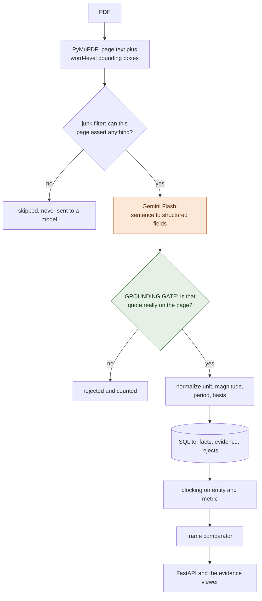
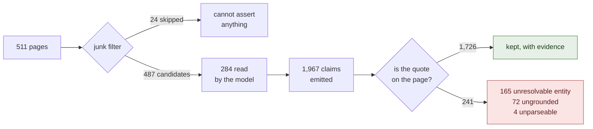
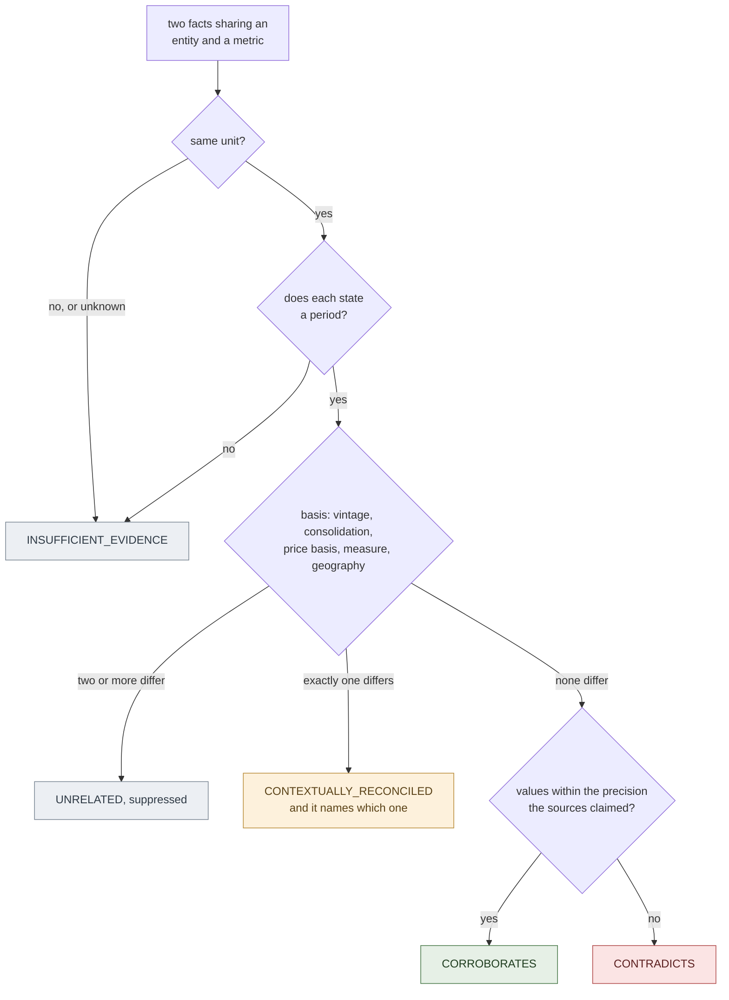

# Tie-Out, a fact knowledge layer with an audit trail

Tie-Out reads PDFs, pulls out claims it can quote, and works out whether two
claims agree, disagree, or only look like they disagree. Every fact it keeps
carries the sentence it came from, and you can click through to see that
sentence highlighted on the actual page.

**[3-minute demo video](#video-demo)**  ·  **[live viewer, no install](https://maaadhavq.github.io/tieout/)**  ·  **[the four required cases](#start-here-all-four-required-cases-no-api-key-under-a-second)**


The idea it rests on:

> **Whether two numbers are comparable is a separate question, asked first,
> from whether they agree.**

So every fact carries a **claim frame** of entity, metric, unit, period and
basis, and the comparator walks those five before it looks at a single value:

| the frame | the values | the verdict |
|---|---|---|
| identical | agree within tolerance | `CORROBORATES` |
| identical | differ beyond tolerance | `CONTRADICTS` |
| differs on exactly one dimension | irrelevant | `CONTEXTUALLY_RECONCILED`, naming the dimension |
| cannot be established | n/a | `INSUFFICIENT_EVIDENCE` |

No model takes part in that decision. It is rules, it is unit-tested, and it
shows its working on screen.

---

## Setup and Run Instructions

```bash
git clone https://github.com/Maaadhavq/tieout && cd tieout
python -m pip install -r requirements.txt
```

Python 3.10+. The real dependencies are PyMuPDF, FastAPI and the Gemini SDK.

### Start here: all four required cases, no API key, under a second

```bash
python -m tieout.verify
```

It prints each case with both facts, the full comparability trace, both
verbatim quotes with document and page, the confidence and the explanation, and
exits non-zero if any case is missing. The cases are found **by query, not by
hard-coded ids**, so it works on any corpus, including one you build yourself.

If you read nothing else here, read that output.

### Then look at it

```bash
python run.py --demo
```

Replays the committed extraction cache over the starter PDFs and serves the
viewer at <http://127.0.0.1:8000>. Same result as a live run, zero API calls.
This is the corpus every number below comes from.

`python run.py --gold` serves a second, smaller corpus built from eleven facts
I located by hand. The UI always says which one is on screen.

### Running it on your own PDFs, the only step that needs a key

```bash
cp .env.example .env        # then put your Gemini key in it
python run.py               # ingests data/starter-datasets/, then serves
```

Then use **Add PDF** in the viewer, or `python run.py --paths your.pdf`.

A free key from [aistudio.google.com](https://aistudio.google.com/apikey) takes
a minute, and this whole corpus was extracted on the free tier. Only *new*
documents need one; everything above runs off the committed cache. Upload
without a key and the app says so, rather than reporting zero facts as a
failure.

### Tests, evaluation, exports

```bash
python -m pytest -q                        # 148 tests, no API key
python -m tieout.eval --db data/demo.db    # accuracy and extraction numbers
curl -o facts.csv localhost:8000/api/export.csv
```

Every CSV row carries its document, page, verbatim quote and match quality
alongside the value. `refused.csv` is the working behind the hallucination rate:
every claim the gate rejected, with the model's own words intact.

### Or just look at it without installing anything

[maaadhavq.github.io/tieout](https://maaadhavq.github.io/tieout/) is the same
viewer as a static snapshot, with every quote and page image intact. Deep links
go straight to each case:
[corroborates](https://maaadhavq.github.io/tieout/#corroborates),
[contradicts](https://maaadhavq.github.io/tieout/#contradicts),
[reconciled](https://maaadhavq.github.io/tieout/#reconciled),
[refused](https://maaadhavq.github.io/tieout/#refused). It is read-only, since
GitHub Pages runs no Python, so uploading needs a local run.

---

## Video Demo

*(link to be added)*

Corroboration across two institutions, a real contradiction, a gap of seven
billion rupees that turns out to be standalone against consolidated, and a
claim the grounding gate threw out.

---

## Approach

### The pipeline

One model call per page, and nothing else. Every other step is deterministic, so
a bad extraction shows up as a *rejected fact* rather than a wrong answer.



The orange box is the only place a model reads a document. The green box checks
its work, and no model takes part in that.

### The grounding gate

Every fact has to carry a verbatim span. Before it is stored, that span is
searched for in the page: exact, then whitespace and ligature normalized, then
fuzzy. If it is not there the fact is **rejected and counted**, and the model's
raw output is kept in a `rejects` table you can browse in the UI.

That is what turns "cite your source" into "have one", and it is where the
hallucination rate comes from. Measured over the starter corpus:



Those 72 ungrounded claims are 3.7% of everything the model produced. That is
the published hallucination rate, and `refused.csv` is the working behind it.

It bites, too. My first gold entry quoted `"8,142 Cr"` and the gate refused it
as too short to be evidence, which was right. Widening it to `"₹8,142 Cr FY24
revenue from services"` carries the value, the period and the metric.

### How a pair becomes a verdict

This is the part worth reading the code for. `tieout/reason/compare.py` is about
150 lines and holds all of it:



Simplified in one respect. A period difference inside a single document, where
the two periods do not overlap, is a time series rather than a reconciliation
and is suppressed. There are 384 of those.

### Normalization is where the work is

Three publishers write the same year three different ways, and one company
writes a different year the same way:

```
Economic Survey  "FY25"        ─┐
RBI              "2024-25"      ├─ 2024-04-01 … 2025-03-31
IMF              "FY2024/25"   ─┘
Delhivery        "FY24"        ─── 2023-04-01 … 2024-03-31
```

Tolerance comes from the precision each source claimed rather than a fixed
epsilon, so `₹81,415.38 million` and `₹8,142 crore` agree while `6.4%` and
`6.5%` do not, even though the second pair is closer in absolute terms.

`basis` carries the dimensions that turn an apparent contradiction into an
explained one: consolidation, **data vintage**, price basis, valuation, measure
and geography. Vintage matters most. Institutional publishers restate the same
period as data firms up, and a system that ignores that reports every
restatement as a contradiction.

### Comparison is cheap, because of blocking

Facts are grouped into blocks keyed on entity and metric, and only facts inside
a block are compared. That is 1,726 facts into 1,274 blocks and **2,628 pairs**,
against 1,488,675 if every fact met every other: **0.18% of the naive work**,
one pass, no API calls.

### Where a model is and is not used

| step | engine |
|---|---|
| reading prose and tables into fields | Gemini Flash |
| verifying the quote exists | deterministic, since the checker must not be the thing being checked |
| unit, magnitude, period, basis normalization | deterministic, unit-tested |
| candidate pair generation | deterministic blocking |
| relationship classification | deterministic, rule-traced |
| "do these two metric labels mean the same thing?" | Gemini Flash, capped at 40 calls, cached with its rationale |
| explanations | templated from the rule trace, so prose and verdict cannot drift |

### AI tools used

Built with Claude Code (Opus 5) for architecture, implementation and tests.
Extraction and alias adjudication call Google Gemini Flash at runtime.

I picked which four cases to demonstrate by reading the source PDFs myself,
before the extractor existed, so the examples are not chosen from whatever the
model happened to produce. What you see demonstrated is the system's own output:
`verify` finds those cases by query in the extracted corpus, and every fact
records the model that produced it, 1,612 from `gemini-flash-lite-latest` and
114 from two others. The hand-labelled set is a separate corpus, `--gold`, and
the UI says so when it is on screen.

---

## The four required cases

All four are in the extracted corpus (`python run.py --demo`) and reproducible
with `python -m tieout.verify`. Page numbers are 1-based into the excerpts.

**1. Corroborated across documents, expressed differently.**
RBI Annual Report p.22 says "6.5 per cent in **2024-25**". IMF Article IV p.10
says "India's real GDP grew by 6.5 percent in **FY2024/25**". Two institutions,
two notations, one interval, so **CORROBORATES** at 0.93.

A harder one from the same corpus: `₹81,415.38 million` in the annual report
against `₹8,142 crore` in the earnings deck, and `₹1,266 Mn` against `₹127 Cr`
for EBITDA. No string matcher finds those. They match only after magnitude
normalization, at the precision the rounder source claimed.

**2. A genuine contradiction.**
Economic Survey p.20 says GDP "grew by **6.7 per cent** … in **Q1** … **FY25**".
RBI p.24 says "**6.5 per cent** in **Q1:2024-25**". Same entity, metric, unit,
price basis and measure, and the two notations normalize to the same quarter.
The values differ by 0.2 points and neither document explains why, so
**CONTRADICTS** at 0.93. It only surfaces if quarters parse correctly. An
earlier version read `"Q1:2024-25"` as the whole year and reported a different,
false contradiction instead.

**3. An apparent contradiction explained by context.**
Economic Survey p.14 says **6.4%** for FY25. RBI p.8 says **6.5%** for 2024-25.
Everything matches except one thing: the Survey is quoting the first advance
estimate, so this is **reconciled on data vintage** at 0.90. The same machinery
reconciles consolidation (standalone against consolidated revenue), measure (GDP
against GVA), and sign convention. There is a non-numeric one too: a director is
active in the 2022 prospectus and *resigned with effect from August 24, 2023* in
the FY24 report, a state change over time reconciled the same way.

**4. An extraction failure, and what I did about it.**
Click **Refused** in the viewer to see all 241 rejected claims with the model's
own words. Four classes:

- **72 ungrounded claims, 3.7% of everything emitted.** The model gave a quote
  that is not on the page, usually a table row label welded to a number from
  another column, like `"Revenue from contract with customers ... 8,035.88"`.
  *Handled: this is the grounding gate working.*
- **163 first-person entities.** Filings say "our Company". Well grounded, but
  they name nothing on their own, so they are refused rather than guessed at.
  *Would improve: resolve them against the document's subject.*
- **14 of the 19 contradictions are lost table row headers.** Reading order
  flattens a table into a stream, so "current" and "non-current" both become
  "Borrowings". They are hedged to 41 or 42% confidence saying exactly that.
  *Would improve: geometry-aware reconstruction from the word boxes already
  stored for the highlights.*
- **One contradiction is confidently wrong.** IMF p.3 reads *"prolonged 50
  percent U.S. tariffs, real GDP is projected to grow at 6.6 percent"*, and the
  model took the **50** as the growth rate. The quote is on the page character
  for character, so the gate passed it: it checks that the quote is there, not
  which number in it the metric refers to. Compared against p.13 it becomes a
  93%-confidence contradiction that is simply wrong. *Would improve: require the
  value to appear near the metric mention inside the quote.*

The negative control matters as much. Economic Survey p.4 and RBI p.26 both say
6.4% for the same country and period. A value-first system corroborates them.
They are GDP and GVA, and the comparator suppresses the pair.

---

## Limitations and Next Steps

### Measured, on the corpus in `data/demo.db`

| | |
|---|---|
| documents and pages | 6 documents, 511 pages, 24 skipped by the junk filter |
| pages a model answered for | **284 of 487 candidates**, the run was cut short, see below |
| facts emitted, then kept | 1,967, then 1,726 |
| refused by the gate | 241 (12.2%): 165 unresolvable entity, 72 ungrounded, 4 unparseable |
| **hallucination rate** | **3.7%**, ungrounded claims over claims emitted |
| quote match quality | 1,712 exact, 12 fuzzy, 2 normalized (99.2% exact) |
| distinct metrics discovered | 961, none hard-coded |
| pairs compared | 2,628, against 1,488,675 naive (0.18%) |
| relationships | 30 corroborates, 19 contradicts, 177 reconciled, 379 insufficient |
| suppressed | 384 same-document time series, 1,540 unresolved alias questions |
| relationship accuracy | 7/7 labelled pairs, 2/2 negative controls |
| cold `--demo`, then `verify` | 0.7 s, then 0.1 s |

**The run is incomplete and the numbers say so.** The free-tier daily quota ran
out partway through, so 284 of 487 candidate pages were actually read. Resuming
costs nothing because of the cache, and every figure above is over the pages
that were read. `/api/stats` reports `pages_extracted` and `pages_candidate`
separately for exactly this reason.

### What does not work yet

- **First-person entities are dropped, not resolved.** 163 facts lost to "our
  Company". Biggest single source of lost recall, and the first thing I would
  fix.
- **Tables lose their row headers**, which is where 14 of the 19 contradictions
  come from.
- **The gate checks the quote, not the binding.** A sentence with two numbers
  can have the wrong one attached and still verify exactly. One contradiction is
  asserted at 93% and is wrong because of this.
- **No OCR.** A scanned page yields nothing.
- **Relative periods are dropped.** 108 facts said "a year ago" or similar with
  no anchor, so they get no period and any comparison returns
  `INSUFFICIENT_EVIDENCE`. That is most of that bucket: 338 of 379 fail on
  period.
- **Units and entities err toward silence.** Nothing is ever converted, since
  no conversion factor is in evidence, so rupees against dollars and TWh against
  GWh are reported incomparable. Entity resolution is exact match or one name
  extending another from the front, because a wrong merge corrupts everything
  downstream. The cost is real: the same sentence came back with and without a
  unit across two documents, and two identical facts then read as a unit
  mismatch instead of corroborating.
- **Metric labels sharing no word are never compared.** "headcount" and "number
  of employees" have zero token overlap, so a genuine contradiction is missed.
- **Confidence is composed, not calibrated.** Not enough labelled pairs to fit
  it honestly, so I did not pretend otherwise.
- **A PDF can address the model, and there is no way around that.** Reading the
  document is the job. The narrower guarantee holds: nothing enters the store
  without a quote that is really on the page, so an injection can only surface as
  *"the document said this"*, never as an invented figure
  (`tests/test_injection.py`).
- **Ingest is synchronous.** An 18-page upload holds the request open for about
  a minute. A job queue would fix that and add moving parts, so at this scale it
  is a deliberate omission.

### Next, in order

1. Resolve first-person entities against the document's subject.
2. Geometry-aware table reconstruction from the stored word boxes.
3. Require the value to appear near the metric mention inside its quote.
4. Let a reviewer correct a verdict in the UI, so corrections become labelled
   pairs and confidence can eventually be calibrated.

---

## Additional Notes

**Adding a document does not rebuild anything.** Blocks are keyed on stored
columns, so a new PDF's facts are compared only against the blocks they join.
Re-uploading one already in the layer is caught by content hash and costs
nothing.

**The decision log is `docs/DECISIONS.md`**, 29 decisions with what each cost.
The most useful is D4: I built a page ranker, measured it against the labelled
set, found it ranked the pages carrying the headline claims in the *bottom
decile*, and deleted it.

**Reading the code.** `tieout/reason/compare.py` is about 150 lines and holds
the whole classification logic. `tieout/normalize/` is where the real difficulty
lives.

**Everything is inspectable without the UI:**

```bash
python -m tieout.verify
curl localhost:8000/api/stats
curl 'localhost:8000/api/relationships?label=CONTEXTUALLY_RECONCILED'
```

Views are deep-linkable, so a case can be sent as a link: `#corroborates`,
`#contradicts`, `#reconciled`, `#insufficient`, `#refused`.

No credentials are in this repository. `.env` is gitignored, and `.env.example`
shows what is needed.
