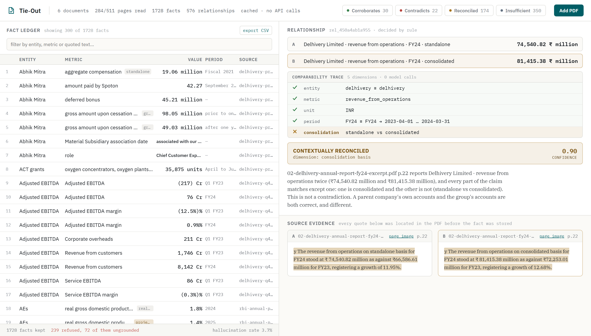

# Tie-Out — a fact knowledge layer with an audit trail

Tie-Out reads PDFs, pulls out claims it can quote, and works out whether two
claims agree, disagree, or only look like they disagree. Every fact it keeps
carries the sentence it came from, and you can click through to see that
sentence highlighted on the actual page.



The idea it all rests on is this:

> **Whether two numbers are comparable is a separate question, asked first,
> from whether they agree.**

So every fact carries a **claim frame** — entity, metric, unit, period, basis —
and the comparator walks those five before it looks at a single value:

| the frame | the values | the verdict |
|---|---|---|
| identical | agree within tolerance | `CORROBORATES` |
| identical | differ beyond tolerance | `CONTRADICTS` |
| differs on exactly one dimension | irrelevant | `CONTEXTUALLY_RECONCILED`, and it names the dimension |
| cannot be established | — | `INSUFFICIENT_EVIDENCE` |

No model takes part in that decision. It is rules, it is unit-tested, and it
shows its working on screen.

---

## Setup and Run Instructions

```bash
git clone https://github.com/Maaadhavq/tieout && cd tieout
python -m pip install -r requirements.txt
```

Python 3.10+. The real dependencies are PyMuPDF, FastAPI and the Gemini SDK.

### Start here — all four required cases, no API key, under a second

```bash
python -m tieout.verify
```

It prints each case with both facts, the full comparability trace, both
verbatim quotes with document and page, the confidence and the explanation, and
exits non-zero if any case is missing. The cases are found **by query, not by
hard-coded ids**, so it works on any corpus — including one you build yourself.

If you read nothing else here, read that output.

### Then look at it

```bash
python run.py --demo
```

Replays the committed extraction cache over the starter PDFs and serves the
viewer at <http://127.0.0.1:8000>. Same result as a live run, zero API calls.
This is the corpus every number below comes from.

There is a second, smaller corpus — `python run.py --gold` — built from eleven
facts I located by hand, pushed through the same grounding, normalization and
comparison code. The UI always says which one is on screen.

### Running it on your own PDFs — the only step that needs a key

```bash
cp .env.example .env        # then put your Gemini key in it
python run.py               # ingests data/starter-datasets/, then serves
```

Then use **Add PDF** in the viewer, or `python run.py --paths your.pdf`.

A free key from [aistudio.google.com](https://aistudio.google.com/apikey) takes
a minute, and the free tier is enough — this whole corpus was extracted on one.
Without a key everything above still works from the committed cache; only *new*
documents need one. If you upload a PDF without a key the app tells you that,
rather than reporting zero facts as though it had failed.

### Tests, evaluation, exports

```bash
python -m pytest -q                        # 146 tests, no API key
python -m tieout.eval --db data/demo.db    # accuracy and extraction numbers
curl -o facts.csv localhost:8000/api/export.csv
```

Every CSV row carries its document, page, verbatim quote and match quality
alongside the value. `refused.csv` is the working behind the hallucination rate:
every claim the gate rejected, with the model's own words intact.

### Or just look at it without installing anything

[maaadhavq.github.io/tieout](https://maaadhavq.github.io/tieout/) — the same
viewer as a static snapshot, with every quote and page image intact. Deep links
go straight to each case:
[corroborates](https://maaadhavq.github.io/tieout/#corroborates) ·
[contradicts](https://maaadhavq.github.io/tieout/#contradicts) ·
[reconciled](https://maaadhavq.github.io/tieout/#reconciled) ·
[refused](https://maaadhavq.github.io/tieout/#refused). It is read-only —
GitHub Pages runs no Python, so uploading needs a local run.

---

## Video Demo

*(link to be added)*

---

## Approach

```
PDF
 └─ PyMuPDF: page text + word-level bounding boxes          deterministic
     └─ junk filter: pages that cannot assert anything      deterministic
         └─ Gemini Flash: structured extraction             model
             └─ GROUNDING GATE: is the quote really there?  deterministic
                 └─ normalize unit · magnitude · period · basis
                     └─ SQLite fact + evidence store
                         └─ blocking on (entity, metric)    deterministic
                             └─ 4-way frame comparator      deterministic
                                 └─ adjudication, only for unsettled aliases
                                     └─ FastAPI · evidence viewer
```

The model does one thing, which it is good at: turning a sentence of financial
English into fields. Everything around it is deterministic, so a bad extraction
shows up as a *rejected fact* rather than a wrong answer.

### The grounding gate

Every fact has to carry a verbatim span. Before it is stored, that span is
searched for in the page — exact, then whitespace and ligature normalized, then
fuzzy. If it isn't there, the fact is **rejected and counted**, and the model's
raw output is kept in a `rejects` table you can browse.

That is what turns "cite your source" into "have one", and it is where the
hallucination rate comes from. It is deliberately the one step no model touches.

It bites, too. My first gold entry quoted `"8,142 Cr"`; the gate refused it as
too short to be evidence, which was right — the quote was widened to
`"₹8,142 Cr FY24 revenue from services"`, which carries the value, the period
*and* the metric.

### Normalization is where the work is

Three publishers write the same year three different ways, and one company
writes a different year the same way:

```
Economic Survey  "FY25"        ─┐
RBI              "2024-25"      ├─ 2024-04-01 … 2025-03-31
IMF              "FY2024/25"   ─┘
Delhivery        "FY24"        ─── 2023-04-01 … 2024-03-31
```

Tolerance comes from the precision each source claimed rather than a fixed
epsilon, so `₹81,415.38 million` and `₹8,142 crore` agree while `6.4%` and
`6.5%` do not — even though the second pair is closer in absolute terms.

`basis` carries the dimensions that turn an apparent contradiction into an
explained one: consolidation, **data vintage**, price basis, valuation, measure,
geography. Vintage matters most: institutional publishers restate the same
period as data firms up, and a system that ignores that reports every
restatement as a contradiction.

### Where a model is and is not used

| step | engine |
|---|---|
| reading prose and tables into fields | Gemini Flash |
| verifying the quote exists | deterministic — the checker must not be the thing being checked |
| unit, magnitude, period, basis normalization | deterministic, unit-tested |
| candidate pair generation | deterministic blocking |
| relationship classification | deterministic, rule-traced |
| "do these two metric labels mean the same thing?" | Gemini Flash, capped at 40 calls, cached with its rationale |
| explanations | templated from the rule trace, so prose and verdict cannot drift |

### AI tools used

Built with Claude Code (Opus 5) — architecture, implementation and tests.
Extraction and alias adjudication use Google Gemini Flash at runtime. The four
demonstrated cases were found by reading the source PDFs by hand before any
extractor existed; they are not model output.

---

## The four required cases

All four are in the extracted corpus (`python run.py --demo`) and reproducible
with `python -m tieout.verify`. Page numbers are 1-based into the excerpts.

**1. Corroborated across documents, expressed differently.**
RBI Annual Report p.22 says "6.5 per cent in **2024-25**"; IMF Article IV p.10
says "India's real GDP grew by 6.5 percent in **FY2024/25**". Two institutions,
two notations, one interval → **CORROBORATES** (0.93).

A harder one from the same corpus: `₹81,415.38 million` in the annual report
against `₹8,142 crore` in the earnings deck, and `₹1,266 Mn` against `₹127 Cr`
for EBITDA. No string matcher finds those; they match only after magnitude
normalization, at the precision the rounder source claimed.

**2. A genuine contradiction.**
Economic Survey p.20 says GDP "grew by **6.7 per cent** … in **Q1** … **FY25**";
RBI p.24 says "**6.5 per cent** in **Q1:2024-25**". Same entity, metric, unit,
price basis and measure; the two notations normalize to the same quarter. The
values differ by 0.2 points and neither document explains why →
**CONTRADICTS** (0.93). It only surfaces if quarters parse correctly — an
earlier version read `"Q1:2024-25"` as the whole year and reported a different,
false contradiction instead.

**3. An apparent contradiction explained by context.**
Economic Survey p.14 says **6.4%** for FY25; RBI p.8 says **6.5%** for 2024-25.
Everything matches except one thing: the Survey is quoting the first advance
estimate → **reconciled on data vintage** (0.90). The same machinery also
reconciles consolidation (standalone vs consolidated revenue), measure (GDP vs
GVA), and sign convention. And a non-numeric one: a director is active in the
2022 prospectus and *resigned with effect from August 24, 2023* in the FY24
report — a state change over time, reconciled the same way.

**4. An extraction failure, and what I did about it.**
Click **Refused** in the viewer to see all 241 rejected claims with the model's
own words. Four classes:

- **72 ungrounded claims (3.7% of everything emitted).** The model gave a quote
  that isn't on the page — usually a table row label welded to a number from
  another column, like `"Revenue from contract with customers ... 8,035.88"`.
  Refused and counted. *Handled: this is the grounding gate working.*
- **163 first-person entities.** Filings say "our Company". Well-grounded, but
  they name nothing on their own, so they're refused rather than guessed at.
  *Would improve: resolve them against the document's subject.*
- **14 of the 19 contradictions are lost table row headers.** Reading order
  flattens a table into a stream, so "current" and "non-current" both become
  "Borrowings". They're hedged to 41–42% confidence saying exactly that.
  *Would improve: geometry-aware reconstruction from the word boxes I already
  store for the highlights.*
- **One contradiction is confidently wrong.** IMF p.3 reads *"prolonged 50
  percent U.S. tariffs, real GDP is projected to grow at 6.6 percent"* and the
  model took the **50** as the growth rate. The quote is on the page character
  for character, so the gate passed it — it checks that the quote is there, not
  which number in it the metric refers to. Compared against p.13 it becomes a
  93%-confidence contradiction that is simply wrong. *Would improve: require the
  value to appear near the metric mention inside the quote.*

The negative control matters as much: Economic Survey p.4 and RBI p.26 both say
6.4% for the same country and period. A value-first system corroborates them.
They are GDP and GVA, and the comparator suppresses the pair.

---

## Limitations and Next Steps

### Measured, on the corpus in `data/demo.db`

| | |
|---|---|
| documents / pages | 6 · 511 pages, 24 skipped by the junk filter |
| pages a model answered for | **284 of 487 candidates** — the run was cut short, see below |
| facts emitted / kept | 1,967 / 1,726 |
| refused by the gate | 241 (12.2%) — 165 unresolvable entity, 72 ungrounded, 4 unparseable |
| **hallucination rate** | **3.7%** — ungrounded claims ÷ claims emitted |
| quote match quality | 1,712 exact, 12 fuzzy, 2 normalized (99.2% exact) |
| distinct metrics discovered | 961, none hard-coded |
| pairs compared | 2,628, against 1,488,675 if compared naively (0.18%) |
| relationships | 30 corroborates · 19 contradicts · 177 reconciled · 379 insufficient |
| suppressed | 384 same-document time series, 1,540 unresolved alias questions |
| relationship accuracy | 7/7 labelled pairs, 2/2 negative controls |
| cold `--demo` / `verify` | 0.7 s / 0.1 s |

**The run is incomplete and the numbers say so.** The free-tier daily quota ran
out partway through, so 284 of 487 candidate pages were actually read. Resuming
costs nothing because of the cache, and every figure above is over the pages
that were read. `/api/stats` reports `pages_extracted` and `pages_candidate`
separately for exactly this reason.

### What does not work yet

- **First-person entities are dropped, not resolved** — 163 facts lost to "our
  Company". Biggest single source of lost recall, and the first thing I'd fix.
- **Tables lose their row headers**, which is where 14 of the 19 contradictions
  come from.
- **The gate checks the quote, not the binding.** A sentence with two numbers
  can have the wrong one attached and still verify exactly. One contradiction is
  asserted at 93% and is wrong because of this.
- **No OCR.** A scanned page yields nothing.
- **Relative periods are dropped** — 108 facts said "a year ago" or similar with
  no anchor, so they get no period and any comparison returns
  `INSUFFICIENT_EVIDENCE`. That is most of that bucket: 338 of 379 fail on
  period.
- **No unit conversion, ever.** Rupees against dollars, TWh against GWh — all
  reported incomparable rather than converted, because no conversion factor is
  ever in evidence. Spelling variants of one unit are folded; different units
  never are.
- **The unit a model returns isn't stable.** The same sentence came back with
  and without a unit across two documents, so two identical facts read as a unit
  mismatch instead of corroborating. Treating an absent unit as compatible with
  any stated one would make TWh and GWh equal, which is worse, so this errs
  toward silence.
- **Metric labels sharing no word are never compared.** "headcount" and "number
  of employees" have zero token overlap, so the pair is never proposed and a
  genuine contradiction is missed.
- **Entity resolution is deliberately shallow** — exact match, or one name
  extending another from the front. A wrong merge corrupts everything
  downstream, so it errs conservative.
- **Confidence is composed, not calibrated.** There are not enough labelled
  pairs to fit it honestly, so I didn't pretend otherwise.
- **A PDF can address the model, and there's no way around that.** Reading the
  document is the job. What is guaranteed is narrower and more useful: nothing
  enters the store without a quote that is really on the page, so an injection
  can only ever surface as *"the document said this"*, with the sentence shown
  next to it — never as an invented figure (`tests/test_injection.py`).
- **Ingest is synchronous.** An 18-page upload holds the request open for about
  a minute. A job queue would fix that and add moving parts; at this scale it's
  a deliberate omission.

### Next, in order

1. Resolve first-person entities against the document's subject.
2. Geometry-aware table reconstruction from the stored word boxes.
3. Require the value to appear near the metric mention inside its quote.
4. Let a reviewer correct a verdict in the UI, so corrections become labelled
   pairs and confidence can eventually be calibrated.

---

## Additional Notes

**Adding a document doesn't rebuild anything.** Blocks are keyed on stored
columns, so a new PDF's facts are compared only against the blocks they join —
existing relationships are never recomputed. Re-uploading a document already in
the layer is caught by content hash and costs nothing.

**The decision log is `docs/DECISIONS.md`** — 29 decisions, each with what else
I considered and what the choice costs. The most useful is probably D4: I built
a page ranker, measured it against the labelled set, found it ranked the pages
carrying the headline claims in the *bottom decile*, and deleted it.

**Reading the code.** The interesting file is `tieout/reason/compare.py` —
about 150 lines, no dependencies beyond the normalizers, and it is the whole
classification logic. `tieout/normalize/` is where the real difficulty lives.

**Everything is inspectable without the UI:**

```bash
python -m tieout.verify
curl localhost:8000/api/stats
curl 'localhost:8000/api/relationships?label=CONTEXTUALLY_RECONCILED'
```

Views are deep-linkable, so a case can be sent as a link: `#corroborates`,
`#contradicts`, `#reconciled`, `#insufficient`, `#refused`.

No credentials are in this repository. `.env` is gitignored; `.env.example`
shows what's needed.
